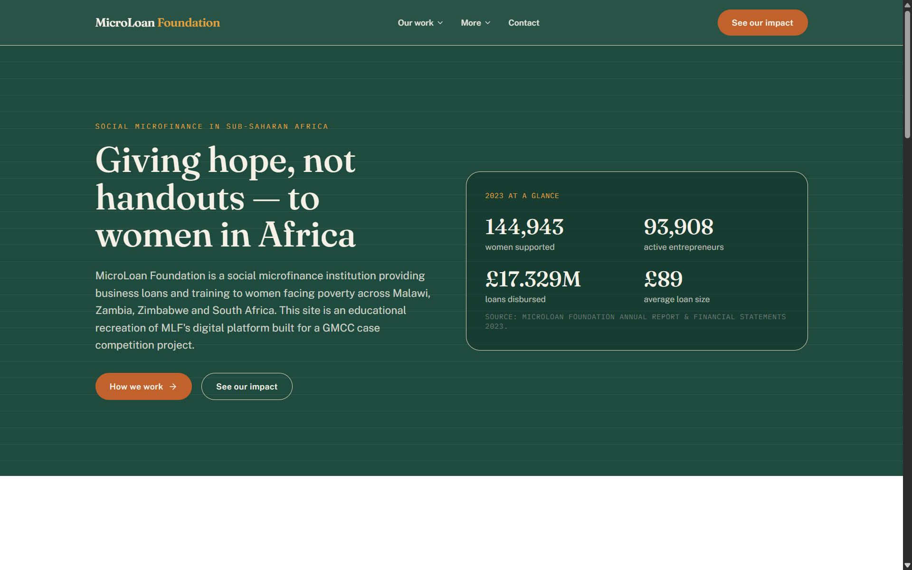
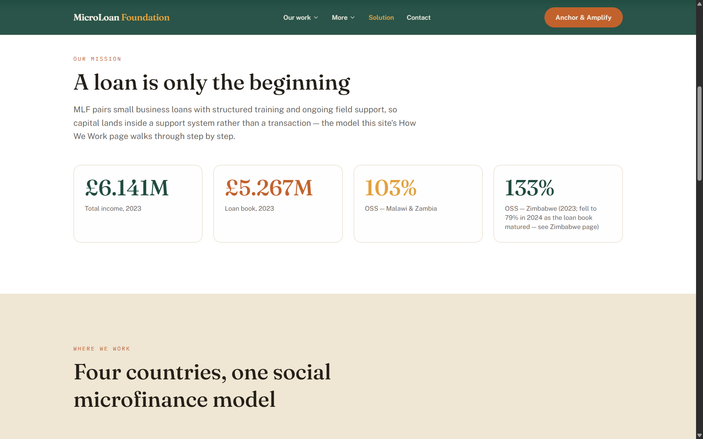
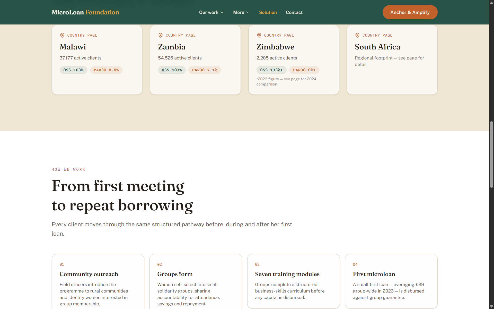
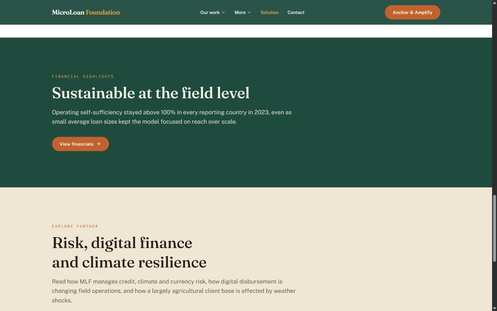
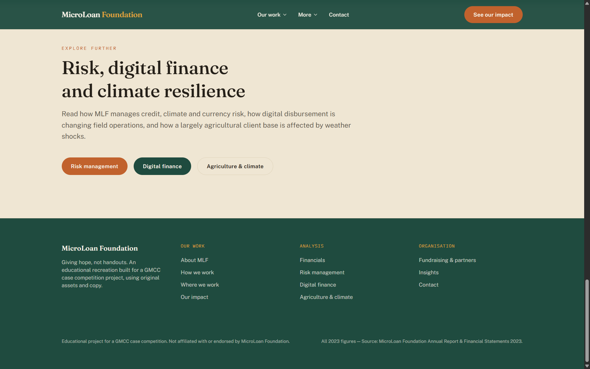

# MicroLoan Foundation

**GMCC Global Microfinance Case Competition**

A modern, research-driven recreation of the **MicroLoan Foundation (MLF)** digital experience, developed for the GMCC Global Microfinance Case Competition. The platform presents MLF's 2023 financial, operational, social-impact, risk, and country-level insights through an interactive and responsive interface.

## Overview


---

---

---

---


## Features

- MLF-inspired responsive website and information architecture
- 2023 financial and operational dashboards
- Country-level analysis for Malawi, Zambia, Zimbabwe, and South Africa
- Interactive financial and operational data visualisations
- Microfinance client journey and operating model
- Social impact and poverty-related insights
- Credit, climate, currency, liquidity, and operational risk analysis
- Digital finance and mobile-money analysis
- Source-backed statistics with centralised data management

## Tech Stack

| Technology | Purpose |
|---|---|
| Next.js | Application framework and routing |
| TypeScript | Type-safe development |
| Tailwind CSS | Styling and responsive design |
| Framer Motion | Animations and transitions |
| Recharts | Data visualisation |
| Lucide React | Interface icons |

## Project Structure
```
MLF-GMCC/
├── .gitignore
├── README.md
├── eslint.config.mjs
├── next.config.ts
├── package.json
├── postcss.config.mjs
├── tsconfig.json
├── docs/
└── src/
    ├── app/
    │   ├── about/
    │   ├── how-we-work/
    │   ├── where-we-work/
    │   │   ├── malawi/
    │   │   ├── zambia/
    │   │   ├── zimbabwe/
    │   │   └── south-africa/
    │   ├── our-impact/
    │   ├── financials/
    │   ├── risk-management/
    │   ├── digital-finance/
    │   ├── agriculture-climate/
    │   ├── partners/
    │   ├── insights/
    │   └── contact/
    ├── components/
    │   ├── ui/
    │   ├── site/
    │   └── charts/
    └── lib/
```

## Getting Started

### Prerequisites
```
- Node.js
- npm
```

### Installation
```
git clone https://www.github.com/samoff04/MLF-GMCC.git
cd MLF-GMCC
npm install
```

### Development
```
npm run dev

Open **http://localhost:3000** in your browser.
```

### Production
```
npm run build
npm start
```

## Disclaimer

This project is an independent academic recreation created for the **GMCC Global Microfinance Case Competition**. It is not affiliated with, endorsed by, or sponsored by MicroLoan Foundation.

All organisational, financial, and operational information is presented for academic analysis and is based on publicly available reporting referenced within the project.

---

**GMCC Global Microfinance Case Competition**

*MicroLoan Foundation — Digital Platform Recreation*

## Author

Samarth Varshney